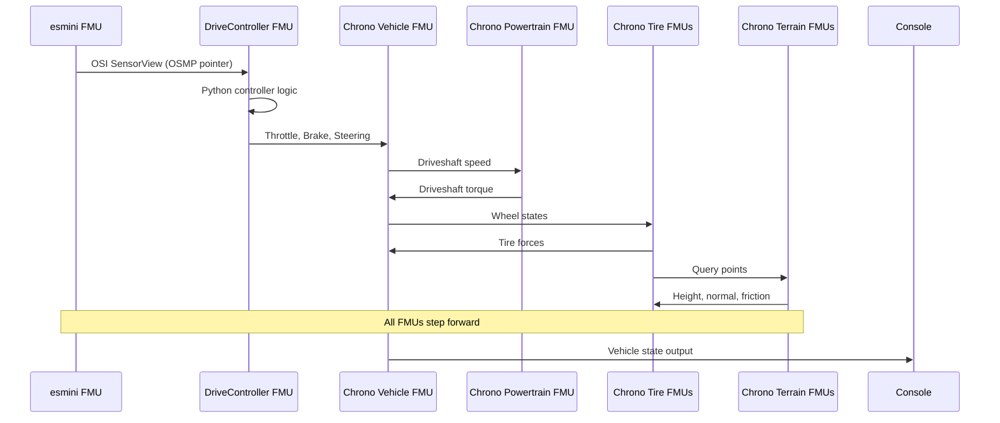

# esmini-DriveController-Chrono 統合実装 Walkthrough

## 実装内容

### 概要

3つのFMUを統合した協調シミュレーションデモを実装しました:

1. **esmini FMU** - OpenSCENARIOシナリオプレイヤー (OSI SensorView出力)
2. **GT-DriveController FMU** - Python埋め込み型コントローラー (OSI入力 → 車両制御出力)
3. **Chrono FMUs** - 車両動力学シミュレーション (Vehicle, Powertrain, Tire x4, Terrain x4)

### 実装したファイル

#### 設定ファイル

- [demo_config.json](file:///E:/Repository/GT-karny/GT-SimulatorIntegration/src/demo/esmini_drive_chrono/demo_config.json)
  - 全FMUのパスとパラメータを設定
  - シミュレーションパラメータ (step_size: 0.01s, end_time: 20.0s)
  - esminiシナリオ: `acc-test.xosc`

#### ヘルパーユーティリティ

- [DemoConfiguration.h](file:///E:/Repository/GT-karny/GT-SimulatorIntegration/src/demo/esmini_drive_chrono/DemoConfiguration.h)
  - chronoデモからコピー
  - 最小限のJSONパーサー

- [FmuHelper.h/cpp](file:///E:/Repository/GT-karny/GT-SimulatorIntegration/src/demo/esmini_drive_chrono/FmuHelper.h)
  - chronoデモからコピー
  - FMI Library操作のラッパー

- [OsiHelper.h](file:///E:/Repository/GT-karny/GT-SimulatorIntegration/src/demo/esmini_drive_chrono/OsiHelper.h)
  - OSMPポインタデコード関数
  - 64ビットポインタを32ビット整数2つから復元

#### メインシミュレーション

- [main.cpp](file:///E:/Repository/GT-karny/GT-SimulatorIntegration/src/demo/esmini_drive_chrono/main.cpp)
  - 全FMUの初期化と協調シミュレーションループ
  - OSI SensorViewの直接ポインタ転送
  - Chrono車両状態のコンソール出力

#### ビルド設定

- [CMakeLists.txt](file:///E:/Repository/GT-karny/GT-SimulatorIntegration/src/demo/esmini_drive_chrono/CMakeLists.txt)
  - FMI Libraryとのリンク
  - demo_config.jsonの自動コピー

- [ルートCMakeLists.txt](file:///E:/Repository/GT-karny/GT-SimulatorIntegration/CMakeLists.txt)
  - esmini_drive_chronoサブディレクトリを追加

#### ドキュメント

- [README.md](file:///E:/Repository/GT-karny/GT-SimulatorIntegration/src/demo/esmini_drive_chrono/README.md)
  - アーキテクチャ説明
  - ビルド・実行手順
  - トラブルシューティングガイド

## ビルド検証

### CMake設定

```bash
cmake -B build -S .
```

**結果**: ✅ 成功
- Windows SDK 10.0.26100.0を使用
- ビルドファイル生成完了

### ビルド

```bash
cmake --build build --config Release
```

**結果**: ✅ 成功
- `esmini_drive_chrono_demo.exe` が生成されました
- 場所: `build/src/demo/esmini_drive_chrono/Release/`

## データフロー詳細

### シミュレーションループ (各ステップ)



### OSIポインタ転送の実装

```cpp
// esminiからOSI SensorViewポインタを取得
int osi_sv_lo, osi_sv_hi, osi_sv_size;
esmini_fmu.GetVariable("OSMPSensorViewOut.base.lo", osi_sv_lo);
esmini_fmu.GetVariable("OSMPSensorViewOut.base.hi", osi_sv_hi);
esmini_fmu.GetVariable("OSMPSensorViewOut.size", osi_sv_size);

// DriveControllerに直接転送 (同一プロセス内)
drivecontroller_fmu.SetVariable("OSI_SensorView_In_BaseLo", osi_sv_lo);
drivecontroller_fmu.SetVariable("OSI_SensorView_In_BaseHi", osi_sv_hi);
drivecontroller_fmu.SetVariable("OSI_SensorView_In_Size", osi_sv_size);
```

**重要**: 両FMUが同一プロセス内で実行されるため、ポインタ値を直接コピーできます。

## 潜在的な問題と対処法

### DriveController FMU関連

DriveController FMUは開発途中のため、以下の問題が発生する可能性があります:

#### 1. OSIデータ受信エラー

**症状**:
- DriveController FMUのステップが失敗
- エラーメッセージ: `DriveController FMU step failed at time X.XX`

**考えられる原因**:

##### A. OSIポインタが無効

```
[DEBUG] OSI SensorView pointer: 0x0 , size: 0 bytes
```

**Feedback for DriveController**:
- esmini FMUからのOSI出力が正しく設定されていない可能性
- esmini側の `OSMPSensorViewOut` 変数の実装を確認
- 初期化時にOSIバッファが確保されているか確認

##### B. OSIメッセージのパースエラー

**Feedback for DriveController**:
- Python側で `osi3.SensorView.ParseFromString()` が失敗している可能性
- OSIバージョンの不一致 (esmini: 3.5.0, DriveController: ?)
- OSIメッセージの内容が不正または空

**デバッグ方法**:
```python
# logic.py内でデバッグ出力を追加
def update_control(self, osi_data: bytes) -> list[float]:
    print(f"[DEBUG] Received OSI data: {len(osi_data)} bytes")
    try:
        sensor_view = SensorView()
        sensor_view.ParseFromString(osi_data)
        print(f"[DEBUG] Parsed successfully, timestamp: {sensor_view.timestamp.seconds}")
    except Exception as e:
        print(f"[ERROR] OSI parse failed: {e}")
        return [0.0, 0.0, 0.0]
```

#### 2. Python実行エラー

**症状**:
- DriveController FMUが初期化に失敗
- または実行中にクラッシュ

**考えられる原因**:

##### A. Pythonランタイム初期化失敗

**Feedback for DriveController**:
- `python312.dll` が正しく読み込まれているか
- `python312._pth` の設定が正しいか
- 必要なPython拡張モジュール (.pyd) が存在するか

##### B. logic.pyが見つからない

**Feedback for DriveController**:
- FMU内の `resources/logic.py` が正しく配置されているか
- Pythonのモジュール検索パスが正しく設定されているか

##### C. logic.py内のエラー

**Feedback for DriveController**:
- `Controller` クラスが正しく定義されているか
- `update_control` メソッドのシグネチャが正しいか
- 戻り値が `[throttle, brake, steering]` の形式か

#### 3. 制御出力の異常

**症状**:
- Chrono車両が異常な動作をする
- 車両が飛んでいく、回転し続けるなど

**考えられる原因**:

##### A. 制御値の範囲外

**Feedback for DriveController**:
- Throttle/Brake/Steeringが範囲外の値を返している
  - Throttle: 0.0 ~ 1.0
  - Brake: 0.0 ~ 1.0
  - Steering: -1.0 ~ 1.0 (左が正)
- NaN値を返している

**デバッグ方法**:
```cpp
// main.cpp内でチェックを追加
if (std::isnan(throttle) || throttle < 0.0 || throttle > 1.0) {
    std::cerr << "Invalid throttle: " << throttle << std::endl;
}
```

##### B. 制御ロジックのバグ

**Feedback for DriveController**:
- `logic.py` のコントローラーロジックにバグがある
- OSIデータから正しく車両状態を取得できていない
- 目標値の計算が間違っている

### esmini FMU関連

#### OSI SensorView出力の問題

**症状**:
- OSIポインタが常にnull
- OSIサイズが常に0

**Feedback for esmini**:
- `OSMPSensorViewOut` 変数の実装を確認
- シナリオ (acc-test.xosc) が正しく読み込まれているか
- esminiの初期化が正しく完了しているか

### Chrono FMU関連

#### 車両動力学の発散

**症状**:
- Vehicle FMUのステップが失敗
- 車両の位置/速度が異常値になる

**考えられる原因**:
- タイムステップが大きすぎる (0.01s → 0.002sに変更)
- 制御入力が極端な値
- タイヤ/地形との連携エラー

## 実行時の期待される出力

### 正常な場合

```
Instantiating FMUs...
Instantiating esmini FMU...
Instantiating DriveController FMU...
Instantiating Vehicle FMU...
Instantiating Powertrain FMU...
Instantiating Tire FMUs...
Instantiating Terrain FMUs...
Setting up parameters...
Initializing...
Starting simulation loop...
Step size: 0.01 s, End time: 20.0 s
================================================================================
[DEBUG] OSI SensorView pointer: 0x... , size: XXXX bytes
Time:   1.00 s | Pos: (  10.50,    0.20,    0.50) | Speed:   5.20 m/s | Throttle:  0.50 | Brake:  0.00 | Steering:  0.05
Time:   2.00 s | Pos: (  25.30,    0.45,    0.50) | Speed:  10.50 m/s | Throttle:  0.60 | Brake:  0.00 | Steering:  0.03
...
================================================================================
Simulation finished at time 20.00 s
```

### エラーが発生した場合

```
Instantiating FMUs...
...
Starting simulation loop...
[DEBUG] OSI SensorView pointer: 0x0 , size: 0 bytes
DriveController FMU step failed at time 0.01
Exception: ...
```

## 実行テスト結果

### 実行コマンド

```bash
cd build/src/demo/esmini_drive_chrono/Release
./esmini_drive_chrono_demo.exe
```

### 発生したエラー

```
Instantiating FMUs...
DEBUG: Allocating context for EsminiFMU
DEBUG: Unzipping FMU E:\Repository\GT-karny\GT-SimulatorIntegration\FMU\gt_drivecontroller\GT-DriveController.fmu
DEBUG: Unzip successful
DEBUG: Parsing XML
DEBUG: XML Parsed
DEBUG: Creating DLL FMU
DEBUG: Failed to load DLL
Exception: Failed to load DLL for FMU: E:\Repository\GT-karny\GT-SimulatorIntegration\FMU\gt_drivecontroller\GT-DriveController.fmu
```

### エラー分析

#### 問題の特定

**DriveController FMU のDLL読み込み失敗**

- esmini FMUは正常に読み込まれている
- DriveController FMUの展開は成功している
- modelDescription.xmlのパースも成功している
- **DLL読み込みの段階で失敗**

#### 確認した内容

1. **FMU構造**: ✅ 正常
   - `binaries/win64/GT-DriveController.dll` 存在 (153,600 bytes)
   - `modelDescription.xml` 存在

2. **依存DLL**: ✅ 存在
   - `python312.dll` (7,484,416 bytes)
   - `python3.dll` (56,320 bytes)
   - `vcruntime140.dll` (124,544 bytes)
   - `vcruntime140_1.dll` (49,792 bytes)
   - `python312.zip` (12,167,664 bytes)
   - `python312._pth` (78 bytes)

3. **DLL読み込み失敗の原因候補**:

   ##### A. Python DLLの依存関係問題

   **最も可能性が高い原因**

   `GT-DriveController.dll` がPython DLLに依存していますが、Windowsのダイナミックリンカーが依存DLLを見つけられない可能性があります。

   **Feedback for DriveController**:
   - **DLLサーチパスの問題**: FMI Library がDLLを読み込む際、`binaries/win64/` ディレクトリがDLLサーチパスに含まれていない可能性
   - **解決策1**: `GT-DriveController.dll` のマニフェストファイルで依存DLLのパスを指定
   - **解決策2**: FMU読み込み前に `SetDllDirectory()` または `AddDllDirectory()` を使用してパスを追加
   - **解決策3**: Python DLLを静的リンクする (サイズは大きくなるが依存関係が減る)

   ##### B. Python初期化の問題

   **Feedback for DriveController**:
   - **DllMain での Python初期化**: `GT-DriveController.dll` の `DllMain` でPythonを初期化している場合、DLL読み込み時に失敗する可能性
   - **推奨**: Python初期化は `fmi2Instantiate` で行い、`DllMain` では最小限の処理のみ
   - **確認**: `DllMain` の実装を確認し、重い処理がないかチェック

   ##### C. VC++ Runtimeのバージョン不一致

   **Feedback for DriveController**:
   - **ビルド環境**: DriveController FMUがどのVisual Studioバージョンでビルドされたか確認
   - **ランタイム**: 実行環境に必要なVC++ Redistributableがインストールされているか
   - **確認方法**: `dumpbin /dependents GT-DriveController.dll` で依存DLLを確認

   ##### D. 64ビット/32ビットの不一致

   **確認済み**: ✅ 問題なし
   - FMUは `binaries/win64/` に配置されている
   - ビルドはx64で実行されている

### 推奨される対処法

#### DriveController開発チームへのFeedback

**優先度: 高**

1. **DLLサーチパスの設定**
   
   FMU内で依存DLLを確実に読み込むため、以下のいずれかを実装:

   ```cpp
   // fmi2Instantiate の最初で実行
   HMODULE hModule;
   GetModuleHandleEx(GET_MODULE_HANDLE_EX_FLAG_FROM_ADDRESS, 
                     (LPCTSTR)fmi2Instantiate, &hModule);
   
   WCHAR path[MAX_PATH];
   GetModuleFileName(hModule, path, MAX_PATH);
   PathRemoveFileSpec(path);  // DLLのディレクトリを取得
   
   SetDllDirectory(path);  // または AddDllDirectory(path)
   ```

2. **Python初期化のタイミング**

   ```cpp
   // DllMain では何もしない
   BOOL WINAPI DllMain(HINSTANCE hinstDLL, DWORD fdwReason, LPVOID lpvReserved) {
       return TRUE;
   }

   // fmi2Instantiate で初期化
   fmi2Component fmi2Instantiate(...) {
       // ここでPython初期化
       Py_Initialize();
       ...
   }
   ```

3. **依存関係の確認**

   ```bash
   # DriveController開発環境で実行
   dumpbin /dependents GT-DriveController.dll
   ```

   期待される出力:
   ```
   python312.dll
   KERNEL32.dll
   VCRUNTIME140.dll
   api-ms-win-crt-runtime-l1-1-0.dll
   ```

4. **テスト方法**

   ```cpp
   // 簡易テストプログラム
   #include <windows.h>
   int main() {
       SetDllDirectory(L"path/to/binaries/win64");
       HMODULE h = LoadLibrary(L"GT-DriveController.dll");
       if (!h) {
           DWORD err = GetLastError();
           printf("LoadLibrary failed: %d\n", err);
       } else {
           printf("LoadLibrary succeeded\n");
           FreeLibrary(h);
       }
   }
   ```

#### 一時的な回避策 (テスト用)

DriveController FMUを一時的にスキップして、esminiとChronoのみで動作確認:

1. `demo_config.json` でDriveControllerをコメントアウト
2. `main.cpp` でDriveControllerの代わりに固定値を使用
3. esminiとChronoの連携を先に確認

### 次のステップ

1. **DriveController開発チームにフィードバック**
   - DLLサーチパスの設定を追加
   - Python初期化タイミングの見直し
   - 依存関係の確認

2. **修正版FMUでの再テスト**
   - 修正されたDriveController FMUで再実行

3. **回避策での動作確認** (オプション)
   - DriveControllerなしでesmini + Chronoの動作確認

## 次のステップ

### 実行テスト

実際にシミュレーションを実行して動作を確認:

```bash
cd build/src/demo/esmini_drive_chrono/Release
./esmini_drive_chrono_demo.exe
```

### 問題が発生した場合

1. **エラーメッセージを確認**: どのFMUでエラーが発生したか
2. **デバッグ出力を確認**: OSIポインタの値、サイズ
3. **README.mdのトラブルシューティングを参照**
4. **Feedbackポイントを確認**: 該当するFMUの開発チームにフィードバック

### 将来の拡張

- OSI TrafficUpdate実装 (Chrono → esmini フィードバック)
- 複数車両のサポート
- esminiビューアの有効化 (`use_viewer: true`)

## まとめ

✅ **完了した項目**:
- 設定システムの実装
- FMUヘルパーユーティリティの準備
- メインシミュレーションループの実装
- OSI直接ポインタ転送の実装
- ビルド設定の作成
- ドキュメントの作成
- ビルド検証

⚠️ **注意事項**:
- DriveController FMUは開発途中のため、実行時エラーの可能性あり
- エラー発生時は、README.mdのトラブルシューティングとこのwalkthroughのFeedbackポイントを参照
- 各FMUの開発チームへのフィードバックが重要

🔧 **推奨される次のアクション**:
1. 実際にシミュレーションを実行
2. エラーが発生した場合、詳細なログを取得
3. 該当するFMUの開発チームにフィードバック
4. 必要に応じてデバッグ出力を追加
